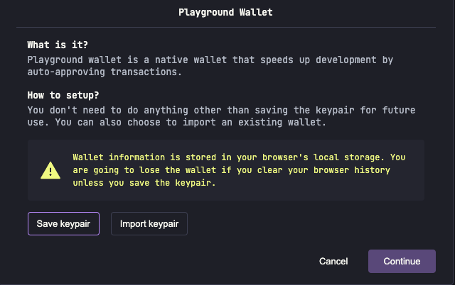
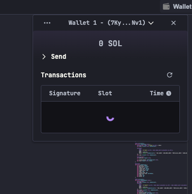
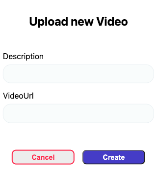
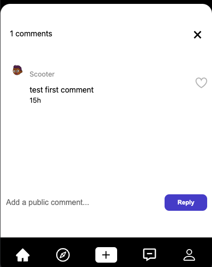

# Tiktok

## 介绍

项目采用Solana + Anchor(Rust) + Phantom 开发，实现了一个简单的Tiktok视频网站。

<div><svg xmlns="http://www.w3.org/2000/svg" width="646" height="96" fill="none"><g clip-path="url(#a)"><path fill="url(#b)" d="m108.53 75.69-17.72 19a4.099 4.099 0 0 1-3 1.31h-84a2.06 2.06 0 0 1-1.51-3.46l17.7-19a4.1 4.1 0 0 1 3-1.31h84a2.05 2.05 0 0 1 1.53 3.46ZM90.81 37.42a4.14 4.14 0 0 0-3-1.31h-84a2.06 2.06 0 0 0-1.51 3.46L20 58.58a4.14 4.14 0 0 0 3 1.31h84a2.06 2.06 0 0 0 1.5-3.46L90.81 37.42Zm-87-13.65h84a4.098 4.098 0 0 0 3-1.31l17.72-19a2.052 2.052 0 0 0-.387-3.14A2.05 2.05 0 0 0 107 0H23a4.1 4.1 0 0 0-3 1.31l-17.7 19a2.06 2.06 0 0 0 1.51 3.46Z"/><path fill="#fff" d="M210.94 40.6H166V25.8h56.62V11h-56.77A14.768 14.768 0 0 0 151 25.69v15a14.768 14.768 0 0 0 14.85 14.71h45v14.8h-58.78V85h58.87a14.766 14.766 0 0 0 13.695-9.044 14.76 14.76 0 0 0 1.155-5.646v-15a14.769 14.769 0 0 0-14.85-14.71ZM298 11h-45.11a14.773 14.773 0 0 0-13.731 9.035A14.752 14.752 0 0 0 238 25.69v44.62c.01 1.943.404 3.865 1.159 5.656A14.77 14.77 0 0 0 252.89 85H298a14.768 14.768 0 0 0 14.85-14.69V25.69a14.76 14.76 0 0 0-4.383-10.42A14.76 14.76 0 0 0 298 11Zm-.11 59.2H253V25.8h44.87l.02 44.4ZM456 11h-44a14.768 14.768 0 0 0-14.85 14.69V85h15V60.69h43.8V85h15V25.69A14.766 14.766 0 0 0 456 11Zm-.11 34.89h-43.8V25.8h43.8v20.09ZM631.15 11h-44a14.768 14.768 0 0 0-14.85 14.69V85h15V60.69H631V85h15V25.69a14.76 14.76 0 0 0-4.383-10.42A14.771 14.771 0 0 0 631.15 11ZM631 45.89h-43.8V25.8H631v20.09ZM544 70.2h-6l-21.45-53a9.887 9.887 0 0 0-9.16-6.2h-13.31a9.845 9.845 0 0 0-9.131 6.035 9.86 9.86 0 0 0-.769 3.765V85h15V25.8h6l21.44 53a9.915 9.915 0 0 0 9.2 6.16h13.31a9.843 9.843 0 0 0 6.98-2.85 9.853 9.853 0 0 0 2.92-6.95V11H544v59.2ZM341.1 11h-15v59.31a14.763 14.763 0 0 0 4.4 10.438A14.775 14.775 0 0 0 341 85h45V70.2h-44.9V11Z"/></g><defs><linearGradient id="b" x1="10.81" x2="98.89" y1="98.29" y2="-1.01" gradientUnits="userSpaceOnUse"><stop offset=".08" stop-color="#9945FF"/><stop offset=".3" stop-color="#8752F3"/><stop offset=".5" stop-color="#5497D5"/><stop offset=".6" stop-color="#43B4CA"/><stop offset=".72" stop-color="#28E0B9"/><stop offset=".97" stop-color="#19FB9B"/></linearGradient><clipPath id="a"><path fill="#fff" d="M0 0h646v96H0z"/></clipPath></defs></svg>

</div>

## 开始

### 1. 安装依赖并启动前端项目

```bash
# 路由到forntend目录
cd frontend
# 安装依赖
yarn
# 启动项目
yarn run dev
```

### 2. 启动后端项目

打开网址 <https://beta.solpg.io/> ，在 `EXPLORER` 栏中，点击 `Create a new project`，在 `Project name` 输入框中输入项目名称(e.g. tiktok-solana)，然后选择 `Anchor(Rust)`，然后点击 `Create`。

打开项目中 `tiktok-clone/programs/tiktok-clone/src/lib.rs` 文件，将该文件内容复制在网页端的 `lib.rs` 文件中

点击 `BUILD & DEPLOY` 栏目中的 `Build` 按钮，等待构建完成后，点击 `Connet to Playground Wallet.` 按钮，连接钱包。点击 `Continue` 按钮。
{ width="350" style="display: block; margin: 0 auto" }

在页面的右上角看到 `Wallet` 按钮，点击 `Wallet` 按钮，可以看到弹出的钱包窗口。
{ width="250" style="display: block; margin: 0 auto" }

点击钱包中的地址，复制该地址，打开Solana水龙头网址(<https://faucet.solana.com/>)，获取 `Devnet` 上的代币。

回到网页端，点击 `Deploy` 按钮，等待部署完成后，在 `TEST` 栏目中，可以看到接口和账户。

### 3. 安装Phantom插件

进入到Chrome网上应用商店，搜索 `Phantom`，安装该插件。打开插件创建钱包，同样在水龙头网站上获取 `Devnet` 上的代币。
<https://chromewebstore.google.com/detail/phantom/bfnaelmomeimhlpmgjnjophhpkkoljpa?hl=zh-CN&utm_source=ext_sidebar>

## 使用

### 1. 连接钱包

进入 <http://localhost:3000> 网址，点击 `Connect Wallet` 按钮，连接钱包。
{ width="250" style="display: block; margin: 0 auto" }

### 2. 注册账户

在注册页面输入账户名和账户图片，点击 `Sign Up` 按钮，注册账户。
{ width="250" style="display: block; margin: 0 auto" }

### 3. 上传视频

进入页面显示为 `No Videos`，点击页面下方 `+` 图标，输入描述和视频地址，进行视频上传。
{ width="250" style="display: block; margin: 0 auto" }

### 4. 留言

进入视频页面，点击留言图标按钮，输入留言内容，点击 `Reply` 按钮，进行留言。
{ width="250" style="display: block; margin: 0 auto" }
